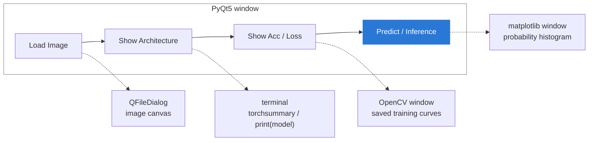
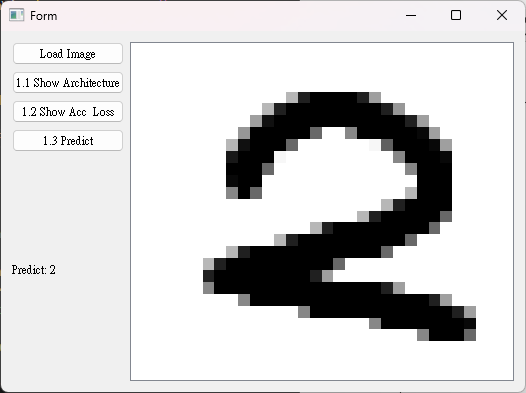
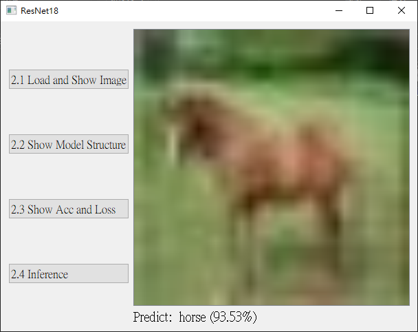
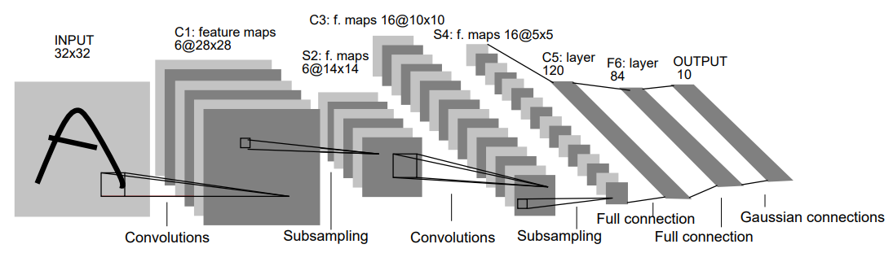
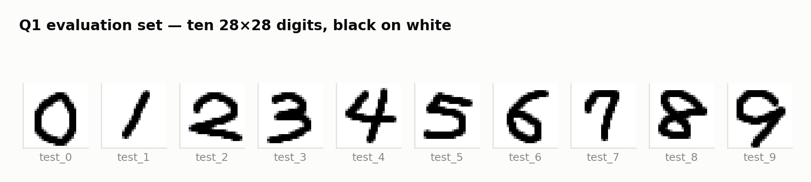
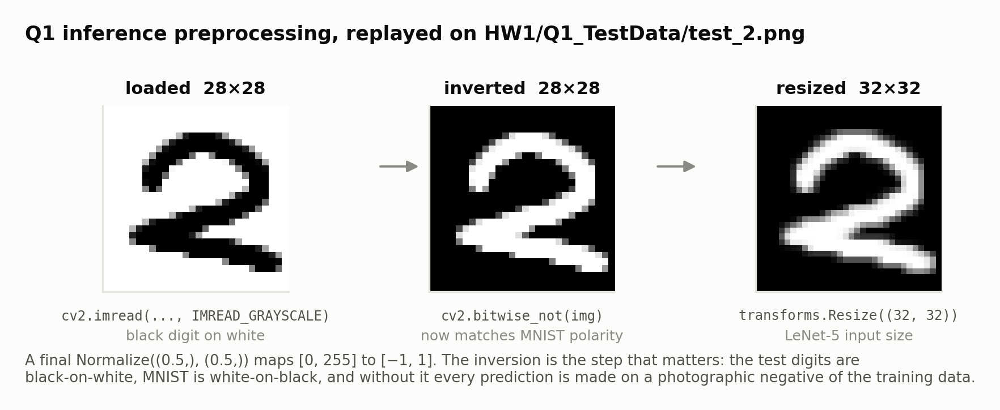
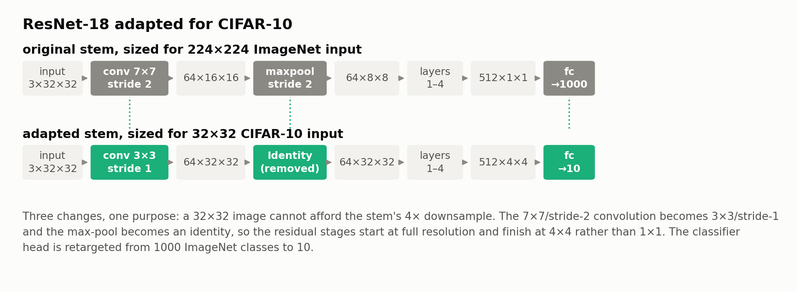
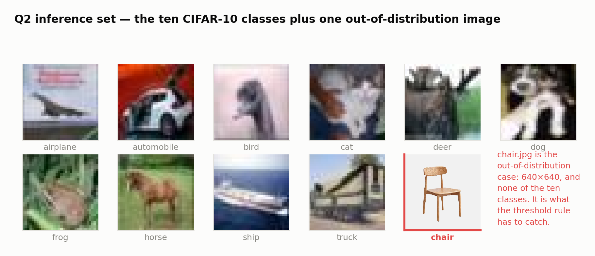
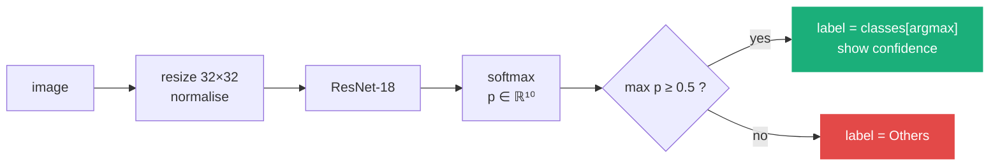
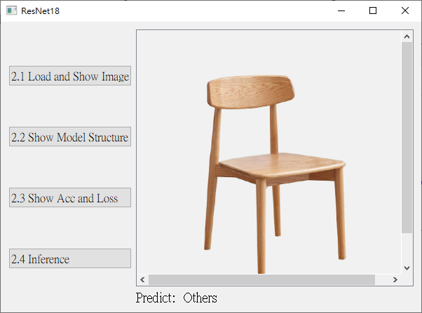

# From LeNet-5 to ResNet-18 — A Two-Model Classifier Workbench with a Qt Front-End

### Introduction to Image Processing, Computer Vision and Deep Learning (2025) · Homework 2 · NCKU CSIE

**Two image classifiers built and trained from scratch in PyTorch — a 1998
LeNet-5 on MNIST and a CIFAR-adapted ResNet-18 — each wrapped in a PyQt5
desktop application that loads an image, shows the network, and explains its
own prediction.**

<p>
  
  
  
  
  
  
</p>

---

## Abstract

This project implements the two canonical convolutional architectures that
bracket the deep-learning era — **LeNet-5** (LeCun et al., 1998; 61,706
parameters) and **ResNet-18** (He et al., 2016; 11.2 M parameters) — trains both
from scratch, and exposes each through a PyQt5 GUI that performs live inference
on user-supplied images.

Two problems make it more than a pair of training scripts. First, ResNet-18 was
designed for 224×224 ImageNet images; applied unmodified to CIFAR-10's 32×32
inputs its stem throws away 94% of the spatial resolution before the first
residual block. Second, a softmax classifier trained on ten classes will
confidently assign one of those ten labels to *anything*, so the CIFAR-10
application needs an explicit rejection rule for images that belong to none of
them.

Measured results: LeNet-5 reaches **≈99.3% MNIST validation accuracy** with
ReLU (≈99.0% with Sigmoid); the adapted ResNet-18 reaches **≈91.5% CIFAR-10
validation accuracy** after 50 epochs. Both are honest numbers read from the
training curves committed to this repository, and §6 discusses where each model
is leaving accuracy on the table.

---

## Contents

- [1. What the application does](#1-what-the-application-does)
- [2. Repository layout](#2-repository-layout)
- [3. Part I — LeNet-5 on MNIST](#3-part-i--lenet-5-on-mnist)
- [4. Part II — ResNet-18 on CIFAR-10](#4-part-ii--resnet-18-on-cifar-10)
- [5. Results](#5-results)
- [6. Discussion and limitations](#6-discussion-and-limitations)
- [7. Running it](#7-running-it)
- [8. References](#8-references)

---

## 1. What the application does

Each part is a self-contained PyQt5 window: a column of task buttons on the
left, an image canvas on the right, and the prediction printed underneath.



<table>
<tr>
<td width="50%"></td>
<td width="50%"></td>
</tr>
<tr>
<td align="center"><em>Part I — MNIST / LeNet-5</em></td>
<td align="center"><em>Part II — CIFAR-10 / ResNet-18</em></td>
</tr>
</table>

> **Figure 1** *(assignment specification)*. The required window layout and
> interaction for each part. Images marked *(assignment specification)* come
> from the course handout and show the target behaviour; every result figure in
> this README is my own output.

---

## 2. Repository layout

```text
HW1/                          Question 1 — MNIST + LeNet-5
├── main.py                   PyQt5 GUI: load, architecture, curves, predict
├── train.py                  LeNet-5 definition + training loop (both activations)
├── model/
│   ├── Weight_Relu.pth       best-validation weights, ReLU
│   └── Weight_Sigmoid.pth    best-validation weights, Sigmoid
├── Loss&Acc_Relu.jpg         recorded training curves
├── Loss&Acc_Sigmoid.jpg
└── Q1_TestData/              ten 28×28 evaluation digits

HW2/                          Question 2 — CIFAR-10 + ResNet-18
├── main.py                   PyQt5 GUI: load, architecture, curves, inference
├── train.py                  CIFAR-adapted ResNet-18 + training loop
├── model/weight.pth          best-validation weights
├── Loss&Acc.jpg              recorded training curves
└── Q2_inference_img/         one image per class, plus one that is in none

docs/figures/                 figures generated by scripts/make_figures.py
docs/spec/                    figures from the assignment handout (attributed)
scripts/make_figures.py       regenerates docs/figures/ from repository assets
```

> **A note on the folder names.** `HW1/` and `HW2/` are **Question 1 and
> Question 2 of Homework 2**, not two separate homeworks — the naming is
> inherited from the submission format the course required. `Q1/` and `Q2/`
> would read better; the original names are kept so the tree matches what was
> submitted.

MNIST and CIFAR-10 download themselves into `data/` on first run and are
git-ignored.

---

## 3. Part I — LeNet-5 on MNIST

### 3.1 The architecture, implemented from scratch

<div align="center">
  
</div>

> **Figure 2** *(assignment specification, after LeCun et al. 1998)*. Two
> convolution/subsampling pairs, a third convolution that collapses the spatial
> dimensions to 1×1, then two fully connected layers.

No `torchvision` model is used; the network is built layer by layer in
[`HW1/train.py`](HW1/train.py), with the activation function injected at
construction time so the same class serves both experiments:

```python
class LeNet5(nn.Module):
    def __init__(self, activation='sigmoid'):
        self.act   = nn.Sigmoid() if activation == 'sigmoid' else nn.ReLU()
        self.conv1 = nn.Conv2d(1,  6,   kernel_size=5, stride=1)   # 32×32 → 28×28
        self.pool1 = nn.AvgPool2d(kernel_size=2, stride=2)         # 28×28 → 14×14
        self.conv2 = nn.Conv2d(6,  16,  kernel_size=5, stride=1)   # 14×14 → 10×10
        self.pool2 = nn.AvgPool2d(kernel_size=2, stride=2)         # 10×10 → 5×5
        self.conv3 = nn.Conv2d(16, 120, kernel_size=5, stride=1)   # 5×5   → 1×1
        self.fc1   = nn.Linear(120, 84)
        self.fc2   = nn.Linear(84,  10)
```

Two details follow the 1998 paper rather than modern practice, and both are
deliberate: **average pooling** instead of max pooling, and **no padding**, so
each convolution shrinks the map by exactly 4 pixels. That is what forces the
28×28 MNIST digits to be resized up to 32×32 — the third convolution needs a
5×5 map to consume.

| Layer | Output shape | Parameters |
| --- | --- | ---: |
| `Conv2d-1` (1→6, 5×5) | 6 × 28 × 28 | 156 |
| `AvgPool2d-2` (2×2) | 6 × 14 × 14 | 0 |
| `Conv2d-3` (6→16, 5×5) | 16 × 10 × 10 | 2,416 |
| `AvgPool2d-4` (2×2) | 16 × 5 × 5 | 0 |
| `Conv2d-5` (16→120, 5×5) | 120 × 1 × 1 | 48,120 |
| `Linear-6` (120→84) | 84 | 10,164 |
| `Linear-7` (84→10) | 10 | 850 |
| **Total** | | **61,706** |

Three quarters of the parameters sit in `Conv2d-5`, which is a fully connected
layer wearing a convolution's clothes: a 5×5 kernel over a 5×5 map. The two
checkpoint files are 251 KB each, consistent with 61,706 float32 parameters.

### 3.2 Sigmoid versus ReLU

Both activations were trained for 20 epochs, Adam at `lr=1e-3`, cross-entropy
loss, with ±15° random rotation as the only augmentation. Only the activation
differs.

<table>
<tr>
<td width="50%"></td>
<td width="50%"></td>
</tr>
</table>

> **Figure 3.** Recorded loss and accuracy for both activations — my own output
> from [`HW1/train.py`](HW1/train.py).

**The interesting result is how little difference there is.** Both converge to
≈99% validation accuracy; ReLU finishes marginally ahead at ≈99.3% against
≈99.0%. The textbook story — sigmoid saturates, gradients vanish, training
stalls — does not appear here, and the reason is worth stating plainly:

- **The network is too shallow to saturate.** Vanishing gradients compound
  multiplicatively with depth. Across five weight layers the sigmoid's
  derivative ceiling of 0.25 costs some signal but never kills it.
- **Adam hides most of what remains.** Per-parameter adaptive step sizes rescale
  exactly the small gradients that the sigmoid produces. Under plain SGD the gap
  would be far more visible.

Where the difference *does* show is in the first epochs: ReLU starts at ≈91%
training accuracy and reaches ≈97.4% after one epoch, while Sigmoid starts at
≈80% and needs three epochs to catch up. ReLU buys convergence speed, not a
better final model. Both checkpoints are kept; the GUI loads the ReLU one.

### 3.3 Inference, and the one step that actually matters

<div align="center">
<picture>
  <source media="(prefers-color-scheme: dark)"  srcset="docs/figures/fig2-q1-testdata-dark.png">
  <source media="(prefers-color-scheme: light)" srcset="docs/figures/fig2-q1-testdata-light.png">
  
</picture>
</div>

> **Figure 4.** The evaluation digits in [`HW1/Q1_TestData/`](HW1/Q1_TestData) —
> **black ink on a white page**. MNIST is the opposite.

That polarity mismatch is the whole problem. MNIST stores white strokes on a
black background; the evaluation digits are scanned the way a human would write
them. Feeding one to a model trained on the other is feeding it a photographic
negative — near-zero input where the model expects signal, and full intensity
across the entire background. The fix is one line, and without it the GUI
predicts essentially at random:

<div align="center">
<picture>
  <source media="(prefers-color-scheme: dark)"  srcset="docs/figures/fig1-q1-preprocessing-dark.png">
  <source media="(prefers-color-scheme: light)" srcset="docs/figures/fig1-q1-preprocessing-light.png">
  
</picture>
</div>

> **Figure 5.** The preprocessing chain from [`HW1/main.py`](HW1/main.py),
> replayed on the real `test_2.png` by
> [`scripts/make_figures.py`](scripts/make_figures.py) — not a mock-up.

```python
img_cv       = cv2.imread(self.file_path, cv2.IMREAD_GRAYSCALE)
img_inverted = cv2.bitwise_not(img_cv)          # ← align polarity with MNIST
img_tensor   = transform(transforms.ToPILImage()(img_inverted)).unsqueeze(0)
```

The prediction and the full softmax distribution are then both shown — the
label on the GUI, the distribution as a matplotlib histogram. Showing the
distribution rather than the argmax alone is what makes a wrong answer
diagnosable: a confident error and a three-way tie look identical if you only
print the winner.

---

## 4. Part II — ResNet-18 on CIFAR-10

### 4.1 Adapting an ImageNet network to 32×32 images

<div align="center">
<picture>
  <source media="(prefers-color-scheme: dark)"  srcset="docs/figures/fig3-resnet-mod-dark.png">
  <source media="(prefers-color-scheme: light)" srcset="docs/figures/fig3-resnet-mod-light.png">
  
</picture>
</div>

> **Figure 6.** The three modifications in
> [`HW2/train.py`](HW2/train.py) and what they do to the feature-map sizes.

Stock ResNet-18 opens with a 7×7 stride-2 convolution followed by a stride-2
max-pool. On a 224×224 ImageNet image that is a sensible 4× reduction. On a
32×32 CIFAR image it leaves the first residual block looking at an 8×8 map —
**94% of the pixels are gone before any residual learning happens**, and the
network finishes at 1×1, with no spatial extent left for the later stages to
work with:

```python
model          = resnet18(weights=None)
model.conv1    = nn.Conv2d(3, 64, kernel_size=3, stride=1, padding=1, bias=False)
model.maxpool  = nn.Identity()
model.fc       = nn.Linear(model.fc.in_features, 10)
```

The three changes cost and save parameters in opposite directions:

| Change | Parameters |
| --- | ---: |
| `torchvision.resnet18` baseline (1000 classes) | 11,689,512 |
| conv1: 7×7×3×64 → 3×3×3×64 | − 7,680 |
| fc: 512→1000 → 512→10 | − 507,870 |
| **Adapted total** | **11,173,962** |

At float32 that is 44.70 MB of weights; `HW2/model/weight.pth` is 44.77 MB, the
difference being BatchNorm running statistics and the archive container.

### 4.2 Training

50 epochs, Adam at `lr=1e-3`, batch size 128, a 90/10 train/validation split of
the 50,000-image training set, with random 32×32 crops from 4-pixel padding and
horizontal flips as augmentation.

<div align="center">
  
</div>

> **Figure 7.** Recorded loss and accuracy — my own output from
> [`HW2/train.py`](HW2/train.py).

Validation accuracy reaches ≈91.5%. The curves also show, unambiguously, that
this run is **overfitting from roughly epoch 15**: training accuracy climbs on
towards ≈98.7% while validation flattens near 91%, and validation loss bottoms
out around 0.33 and then drifts slightly upward while training loss keeps
falling to ≈0.04. Everything after epoch ~25 is the model memorising the
training split. §6 lists what would fix it.

### 4.3 Inference, and rejecting what the model was never taught

<div align="center">
<picture>
  <source media="(prefers-color-scheme: dark)"  srcset="docs/figures/fig4-q2-images-dark.png">
  <source media="(prefers-color-scheme: light)" srcset="docs/figures/fig4-q2-images-light.png">
  
</picture>
</div>

> **Figure 8.** [`HW2/Q2_inference_img/`](HW2/Q2_inference_img) — one image per
> CIFAR-10 class, plus `chair.jpg`, which belongs to none of them.

A softmax layer is a probability distribution over exactly ten outcomes. Show it
a chair and it will not say "I don't know"; it will pick whichever of its ten
classes the chair happens to resemble, and it may do so confidently. The
application therefore applies a rejection rule on top of the classifier:



```python
max_prob, predicted_id = torch.max(F.softmax(output, dim=1), 1)
result_text = "Others" if max_prob.item() < 0.5 else self.classes[predicted_id.item()]
```

<table>
<tr>
<td width="50%"></td>
<td width="50%"></td>
</tr>
<tr>
<td align="center"><em>In one of the ten classes → label + confidence</em></td>
<td align="center"><em>Below threshold → <code>Others</code></em></td>
</tr>
</table>

> **Figure 9** *(assignment specification)*. The two required outcomes. The
> probability histogram is shown alongside in both cases, so the reader can see
> *why* the decision went the way it did rather than having to trust the label.

Note that `chair.jpg` is 640×640 while the CIFAR images are 32×32 — it goes
through the same `Resize((32, 32))` as everything else, so the rejection has to
work on a 32×32 thumbnail of a chair, not on a detailed photograph.

---

## 5. Results

| | Part I — LeNet-5 / MNIST | Part II — ResNet-18 / CIFAR-10 |
| --- | --- | --- |
| Parameters | 61,706 | 11,173,962 |
| Training set | 60,000 (full MNIST train) | 45,000 (90% of CIFAR-10 train) |
| Validation set | 10,000 (MNIST test) | 5,000 (10% held out) |
| Epochs | 20 | 50 |
| Optimiser | Adam, `lr=1e-3` | Adam, `lr=1e-3` |
| Augmentation | ±15° rotation | random crop (pad 4) + horizontal flip |
| **Best validation accuracy** | **≈99.3%** (ReLU) · ≈99.0% (Sigmoid) | **≈91.5%** |
| Final training accuracy | ≈99.5% | ≈98.7% |
| Checkpoint | 251 KB × 2 | 44.8 MB |

Accuracies are read from the training curves committed in this repository
(`HW1/Loss&Acc_*.jpg`, `HW2/Loss&Acc.jpg`); the training scripts plot the
histories but do not write them to a machine-readable log, which is why they are
quoted to one decimal place rather than exactly. Logging the per-epoch history
to CSV is the first thing I would change.

---

## 6. Discussion and limitations

**The CIFAR-10 run leaves several points on the table, and the curves say where.**
The train/validation gap opens at epoch ~15 and never closes. Four things would
narrow it, roughly in order of expected payoff:

1. **A learning-rate schedule.** Adam runs at a constant `1e-3` for all 50
   epochs. Cosine annealing, or a step decay at epochs 30 and 40, is the single
   most common difference between a ~91% CIFAR-10 ResNet and a ~94% one.
2. **Weight decay.** `Adam` is used with default `weight_decay=0`. `AdamW` at
   `5e-4`, or plain SGD with momentum 0.9 and the same decay, regularises a
   network of 11 M parameters trained on 45,000 images considerably better.
3. **Per-channel normalisation statistics.** The transform uses
   `Normalize((0.5,0.5,0.5), (0.5,0.5,0.5))`. CIFAR-10's actual channel means
   and standard deviations are `(0.4914, 0.4822, 0.4465)` and
   `(0.2470, 0.2435, 0.2616)`; using them centres the input distribution
   properly.
4. **Stronger augmentation.** Crop and flip are the minimum. Cutout or
   RandAugment addresses memorisation directly.

**The rejection rule is the weakest part of the design, and it is weak for a
known reason.** Thresholding the maximum softmax probability is the baseline
out-of-distribution detector precisely because it is the most obvious one — and
modern networks are systematically *overconfident* on inputs far from their
training distribution, which is exactly the regime the rule is meant to catch. A
chair rendered at 32×32 can easily produce a 0.9 probability on `truck`. The
threshold of 0.5 was chosen by hand and never tuned against a held-out set of
out-of-distribution images, so its true rejection rate is unmeasured. Temperature
scaling (ODIN) or an energy-based score would be a better detector at essentially
no extra cost, and either could be evaluated properly by labelling a small OOD
set and reporting AUROC instead of a single threshold.

**Sigmoid versus ReLU was the wrong experiment to expect a large effect from.**
As §3.2 argues, five weight layers trained with Adam is not a regime where
activation saturation dominates. A version of this comparison that would
actually be informative would hold the optimiser at plain SGD and vary depth —
the effect the comparison is meant to illustrate needs depth to appear.

**Repository hygiene.** `HW2/model/weight.pth` is a 44 MB binary committed
directly to Git; every future change to it will add another 44 MB to the history.
Git LFS, or publishing weights as a release asset, is the right home for it. The
`HW1/` and `HW2/` folder names mean Q1 and Q2, which reads confusingly outside
the submission context.

---

## 7. Running it

Each part runs independently from its own folder, because both scripts resolve
`model/` and the training-curve images relative to the working directory.

```bash
pip install torch torchvision --index-url https://download.pytorch.org/whl/cu118
pip install opencv-contrib-python matplotlib PyQt5 torchsummary
```

```bash
cd HW1 && python main.py      # MNIST / LeNet-5
cd HW2 && python main.py      # CIFAR-10 / ResNet-18
```

The checkpoints in `model/` are committed, so the GUIs run without retraining.
To retrain from scratch — MNIST and CIFAR-10 download themselves on first run:

```bash
cd HW1 && python train.py     # ~20 epochs × 2 activations
cd HW2 && python train.py     # 50 epochs; a GPU is strongly recommended
```

Both scripts overwrite `model/*.pth` and the `Loss&Acc*.jpg` figures. Regenerate
the README figures with:

```bash
python3 scripts/make_figures.py    # needs opencv-python, numpy, matplotlib
```

Tested against Python 3.9+, PyTorch 2.8, torchvision 0.23, OpenCV 4.12,
PyQt5 5.15, matplotlib 3.9.

---

## 8. References

1. Y. LeCun, L. Bottou, Y. Bengio, P. Haffner. *Gradient-Based Learning Applied
   to Document Recognition.* Proceedings of the IEEE, 86(11), 1998. — LeNet-5.
2. K. He, X. Zhang, S. Ren, J. Sun. *Deep Residual Learning for Image
   Recognition.* CVPR 2016. — ResNet.
3. A. Krizhevsky. *Learning Multiple Layers of Features from Tiny Images.* 2009.
   — the CIFAR-10 dataset.
4. D. Hendrycks, K. Gimpel. *A Baseline for Detecting Misclassified and
   Out-of-Distribution Examples in Neural Networks.* ICLR 2017. — the
   maximum-softmax-probability rule used in §4.3, and its limits.
5. S. Liang, Y. Li, R. Srikant. *Enhancing the Reliability of Out-of-Distribution
   Image Detection in Neural Networks (ODIN).* ICLR 2018.
6. D. Kingma, J. Ba. *Adam: A Method for Stochastic Optimization.* ICLR 2015.

---

## Provenance and attribution

Implementation by **部政佑 (Cheng-Yu Pu)** — Department of Computer Science and
Information Engineering, National Cheng Kung University
([github.com/pukyle](https://github.com/pukyle)).

Written for *Introduction to Image Processing, Computer Vision and Deep
Learning* (2025), Homework 2, NCKU CSIE.

Figures in `docs/spec/` and every figure captioned *(assignment specification)*
are reproduced from the course handout (TA 謝是奎, NCKU CSIE Robotics Lab) to
show the behaviour the assignment required; Figure 2 is after LeCun et al.
(1998). They are included for explanation and remain the property of their
authors. **Everything else is mine**: all code in `HW1/` and `HW2/`, the training
curves in Figures 3 and 7, and the figures in `docs/figures/`, which
[`scripts/make_figures.py`](scripts/make_figures.py) generates from assets in
this repository.

Code released under the [MIT License](LICENSE).
